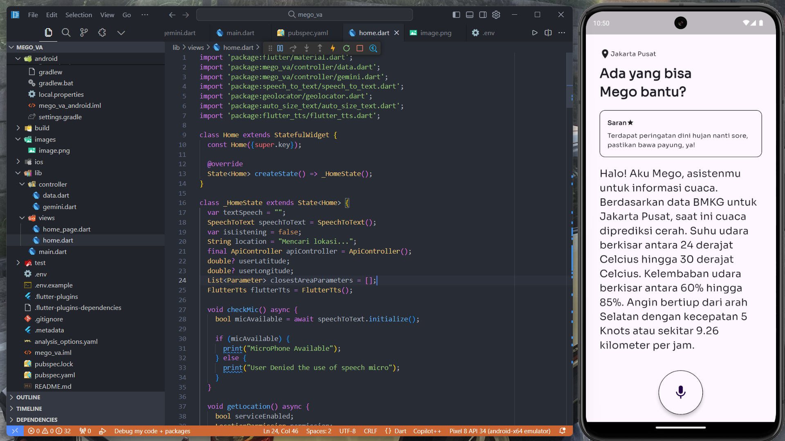
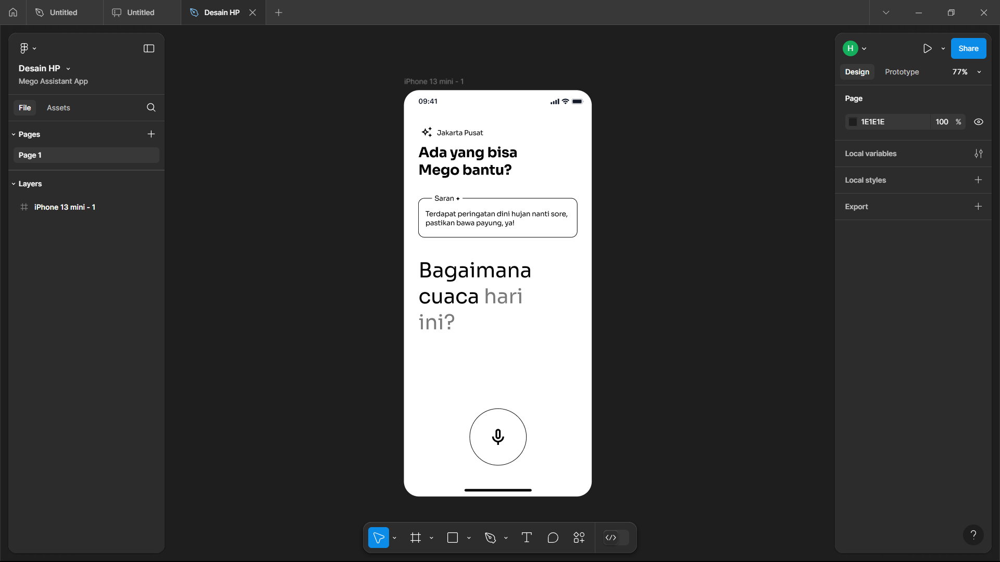
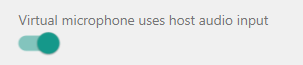

# Mego Virtual Asisstant App

This app is meant to be my project for Hackathon HMKG 2024, but I didnt make it. So, I will make it public.

This app is about bringing the new fresh AI especially LLM (Large Language Model) technology to users can access and understand BMKG data. With LLM like Gemini, we can remove boundaries like language different, complex words, etc. LLM can understand human natural language and then return it with useful and understandable information for users.

## Screenshoots

## Getting Started

This app uses an environment variable for Gemini API Key. You can create your API key in [Google AI Studio](https://aistudio.google.com/). After that, you can rename `.env.example` to `.env`. After that you are good to go.

Notes:
- Android Emulator (AVD) on default can't use microphone from host (your PC). To turn it on go to three dot `...` in the emulator window and search for `Microphone` and then turn on the third radio button.

- Some files in iOS have not been set, maybe it will show some crashes in iOS.
- Location premission in Android has a bug. It doesnt appear in the first launch of the app. Enable it manually in the app settings.

